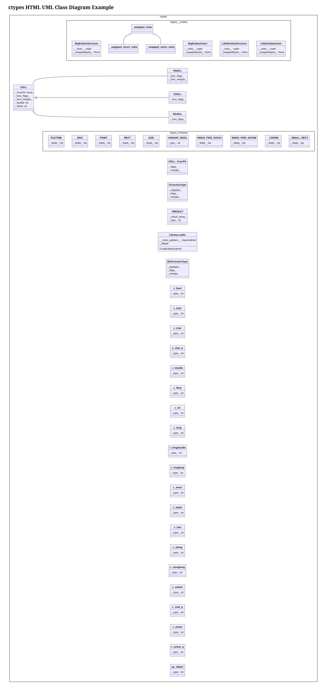
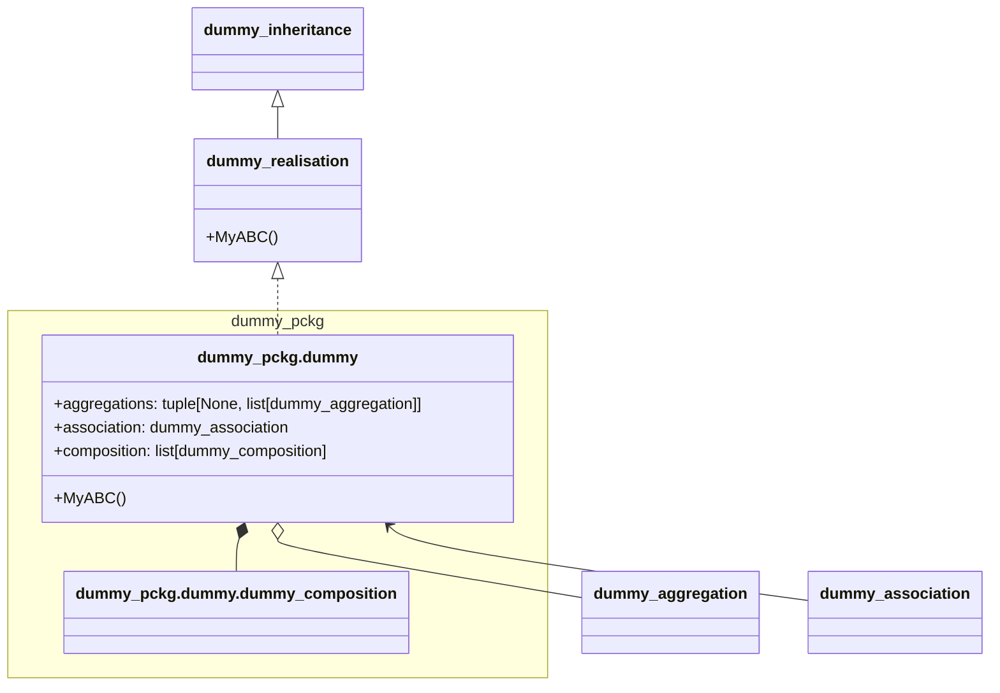

A Python package to discover class relationships in Python packages and draw them into Mermaid UML class diagrams. As of today (March 2026), this project is related to:

+ The [pymermaider](https://github.com/diceroll123/pymermaider) project, but the issue was pymermaider could only generate one diagram for each single python module with incorrect joint namespace handling. Additionally, it couldn't handle complex class relationships properly.
+ The [mermaid-py](https://github.com/ouhammmourachid/mermaid-py) which couldn't handle class diagrams at the time I started this AI coding adventure.

Indeed, everything in this adventure was assisted by AI, even the logo.

## Features

- [x] **Two-phase extraction**: Discover classes first, then generate diagrams
- [x] **Recursive scanning**: Analyzes entire Python packages automatically
- [x] **Namespace-aware**: Respects Python package structure and `__init__.py` files
- [x] **Multiple relationship types**: handling of Inheritance, composition, aggregation, association and realization.
- [x] **Type extraction**: Supports type hints and inferred types
- [x] **Flexible output**: Generate both Markdown and HTML Mermaid diagrams
- [x] **Command-line interface**: Easy-to-use CLI with `mermaiden` command with the `mermaider diagram --filters` that accepts a list of regex patterns to filter classes/modules.
- [x] **Inverted mermaiden**: Created the `mermaiden generate` tool to create the python package skeleton from Mermaid diagram.

## Compatibility

This package is compatible with Python `3.10+` and Mermaid `10.7.0` with some extra compatibility with Mermaid `11.X.0`.

Here is the actual Mermaid version used:

```mermaid
info
```

## Installation

### From Source

Install the package in editable mode from the source repository:

```bash
# Using pip
pip install -e .

# Or using uv (recommended)
uv pip install -e .
```

### Development Installation

For development with optional dependencies:

```bash
# Using pip
pip install -e ".[dev]"

# Or using uv
uv pip install -e ".[dev]"
```

## Usage

### Command Line Interface

After installation, you can use the `mermaiden` command:

```bash
# Phase 1: Discover classes in a Python package
mermaiden discover ./src --output classes.txt

# Follow package exports declared in __init__.py instead of raw filesystem paths
mermaiden discover ./src --output classes.txt --follow init.py

# Start namespaces from the provided root directory
mermaiden discover ./src --output classes.txt --namespace-from-root
```

Which will create a file `classes.txt` with the following content extracted from the `ctypes` module:

```
# ROOT	/usr/lib/python3.13/ctypes
# FQCN	FILEPATH	LINENO	IMPORT_ROOT
ctypes.CDLL	/usr/lib/python3.13/ctypes/__init__.py	322	/usr/lib/python3.13
ctypes.CDLL._FuncPtr	/usr/lib/python3.13/ctypes/__init__.py	384	/usr/lib/python3.13
```

The different columns are:
- `FQCN`: Fully Qualified Class Name
- `FILEPATH`: Path to the file containing the class
- `LINENO`: Line number where the class is defined
- `IMPORT_ROOT`: Root directory for imports

> [!NOTE] TODO
> Check the `IMPORT_ROOT` usage, which is the root directory for imports, and might be unnecessary as the `FILEPATH` already contains the full path.

```bash
# Phase 2: Generate Mermaid UML diagram from inventory
mermaiden diagram classes.txt --output UMLdiagram.md

# Reverse phase: Generate Python scaffold from Mermaid UML markdown/html
mermaiden generate UMLdiagram.md --output generated_src
```

Which generates a Markdown file `UMLdiagram.md` with the following [content](examples/ctypesUML.md) for the `ctypes` module:




### Advanced Options

```bash
# Generate HTML output instead of Markdown
mermaiden diagram classes.txt --output diagram.html

# Customize namespace rendering (nested or legacy)
mermaiden diagram classes.txt --namespace nested

# Choose identifier style (flat or escaped)
mermaiden diagram classes.txt --style flat

# Toggle aliases for classes and namespaces
mermaiden diagram classes.txt --aliases

# Filter included classes/modules with regex (matches class name, qualname, module, or FQCN)
mermaiden diagram classes.txt --filters '^pkg\.service' 'Controller$'

# Explicitly pass an empty filter list (equivalent to no filtering)
mermaiden diagram classes.txt --filters

# Custom titles
mermaiden diagram classes.txt --markdown-title "My Project UML" --html-title "My Project Diagram"
```

### Reverse Generation

You can invert the process and generate a default Python package structure from Mermaid UML diagrams:

```bash
# Generate scaffold from Markdown diagram
mermaiden generate UMLdiagram.md --output generated_src

# Generate scaffold from HTML diagram
mermaiden generate UMLdiagram.html --output generated_src
```

The `generate` command parses Mermaid `classDiagram` source from:
- Markdown fenced Mermaid blocks (` ```mermaid ... ``` `)
- HTML `<pre class="mermaid">...</pre>` blocks

It then creates a default module/package structure with:
- `__init__.py` package files
- Class stubs
- Best-effort inheritance and relation-based attributes inferred from the UML

### Python API

You can also use the package directly in Python code:

```python
from mermaiden import main
import sys

# Use the CLI programmatically
sys.argv = ["mermaiden", "discover", "./src", "--output", "classes.txt"]
main()

sys.argv = ["mermaiden", "diagram", "classes.txt", "--output", "diagram.md"]
main()
```

### The choice of the extra parameters

As of October 2025, `Gitlab 18.0` uses Mermaid `10.7.0`, most probably because the huge amounts of bugs introduced in `11.X.0` versions. To make the tool compatible with Gitlab's version of Mermaid `10.7.0`, this project uses some extra parameters:

+ `--style`
  + `flat`: Uses the flat style (default) to remove the `.` of in submodule names and replace them by `_`:

```
classDiagram
    namespace mypackage_subpackage {
        ...
    }
```

  + `escaped`: Uses the markdown escape character (backtick) introduced in versions `>= 11.4.0` but randomly broken in version `11.13.0` of the live mermaid editor when testing:

```
classDiagram
    namespace `mypackage.subpackage` {
        ...
    }
```

+ `--namespace`
  + `flat`: Uses the flat namespace format (default) with the namespace include class trick:

```
classDiagram
    namespace `mypackage.subpackage` {
        class subsubpackage
        class MySubPackageClass{
            ...
        }
    }
    namespace `mypackage.subpackage.subsubpackage` {
        class MySubSubPackageClass{
            ...
        }
    }
```

  + `nested`: Uses the nested namespace format introduced in versions `>= 11.3.0` but randomly broken for recursive namespaces in version `11.13.0` of the live mermaid editor when testing:

```
classDiagram
    namespace `mypackage.subpackage` {
        class MySubPackageClass{
            ...
        }
        namespace `mypackage.subpackage.subsubpackage` {
            class MySubSubPackageClass{
                ...
            }
        }

    }
```

+ `--aliases`
  + given: emits aliases on class and namespace declarations

```
class `dummy_pckg.dummy.dummy_composition`["dummy.dummy_composition"] {
}
namespace `dummy_pckg`["dummy_pckg"]{
  ...
}
```

  + not given: (defaults) emits raw identifiers without aliases, as they are unecessary with `--style=escaped`. Also for compatibility reasons as Mermaid `10.7.0` doesn't support aliases.

```
class `dummy_pckg.dummy.dummy_composition` {
}
namespace `dummy_pckg`{
  ...
}
```

+ `--filters`
  + optional list of regex patterns to keep only matching classes in the diagram output.
  + each class is tested against: class name, qualname, module, and FQCN.
  + if at least one regex matches, the class is included.
  + passing `--filters` with no values gives an empty list and behaves like no filtering.

```bash
# Keep classes whose fqcn/module/name matches either regex
mermaiden diagram classes.txt --filters '^myapp\.domain' 'Service$'
```

So this package wishes to be able to use all the new functionalities of Mermaid in future stable versions while being compatible with older versions.

## Two-Phase Workflow

1. **Discovery Phase**: Scan your Python source code and create an inventory file containing class information
2. **Diagram Phase**: Read a potentially manually filtered inventory file and generate a Mermaid UML class diagram either in markdown or HTML format.

This two-phase approach allows you to:
- Save and reuse class inventories
- Manually filter the inventory file to focus on specific classes or relationships
- Generate multiple diagram formats from the same analysis
- Share class information without exposing source code

> [!NOTE]
> The HTML version lets you save the diagram as a PDF or SVG image file which is particularly useful for a huge amount of classes in the UML diagram.

## Output Formats

### Markdown (.md)
Generates a Markdown file with embedded Mermaid diagram that can be rendered by:
- GitHub/GitLab
- Obsidian
- Mermaid Live Editor
- Any Markdown viewer with Mermaid support

### HTML (.html)
Generates a standalone HTML file with:
- Embedded Mermaid.js library
- Interactive diagram rendering
- No external dependencies

## License

This project is licensed under the GNU General Public License v3.0 or later. See the [LICENSE](LICENSE) file for details.

## Contributing

Contributions are welcome! Please feel free to submit a Pull Request. For development:

### Development Setup

```bash
# Install in development mode
pip install -e ".[dev]"

# Or using uv
uv pip install -e ".[dev]"
```

### Pre-commit Hooks

This project uses pre-commit hooks to ensure code quality. To set them up:

```bash
# Install pre-commit (if not already installed)
pip install pre-commit

# Install the hooks
pre-commit install

# Run hooks on all files (initial setup)
pre-commit run --all-files
```

The pre-commit configuration includes:
- **Black**: Code formatting
- **isort**: Import sorting
- **flake8**: Linting with comprehensive plugins
- **mypy**: Static type checking

### Manual Code Quality Checks

You can also run the tools manually:

```bash
black src/ tests/
isort src/ tests/
flake8 src/ tests/
mypy src/
```

### Testing

```bash
# Run tests
pytest

# Run tests with coverage
pytest --cov=src --cov-report=html

# Run specific test file
pytest tests/test_example.py
```

## Examples

### Basic Usage

The generation of the `ctypes` inventory and UML diagram:

```bash
# Phase 1: Discover classes in the ctypes module
mermaiden discover /usr/lib/python3.13/ctypes --output ctypes.txt

# Phase 2: Generate Mermaid UML diagram from inventory
mermaiden diagram ctypes.txt --output ctypesUML.md
```

### The dummy package example

```bash
# Phase 1: Discover classes in the dummy package
mermaiden discover ./examples/dummy_pckg/src --output examples/dummy_pckg.txt --style escaped

# Phase 1 (alternative): follow re-exports from __init__.py to flatten namespaces
mermaiden discover ./examples/dummy_pckg/src --output examples/dummy_pckg_follow_init.txt --style escaped --follow init.py

# Phase 1 (alternative): add the leading `src.` namespace prefix
mermaiden discover ./examples/dummy_pckg/src --output examples/dummy_pckg_from_root.txt --style escaped --namespace-from-root

# Phase 2: Generate Mermaid UML diagram from inventory
mermaiden diagram examples/dummy_pckg.txt --output examples/dummy_pckgUML.md --style escaped --namespace nested
```

Which generated this Mermaid UML diagram that should be compatible with github Mermaid `11.13.0`.




### Django Project Example (Auto-generated)

```bash
# Analyze a Django project
mermaiden discover ./myproject --output django_classes.txt
mermaiden diagram django_classes.txt --output django_uml.md

# Analyze a FastAPI application
mermaiden discover ./app --output fastapi_classes.txt
mermaiden diagram fastapi_classes.txt --output fastapi_uml.html --html-title "FastAPI Architecture"
```

## Support

If you encounter any issues or have questions, please file an issue on the project repository or fork it to contribute.
