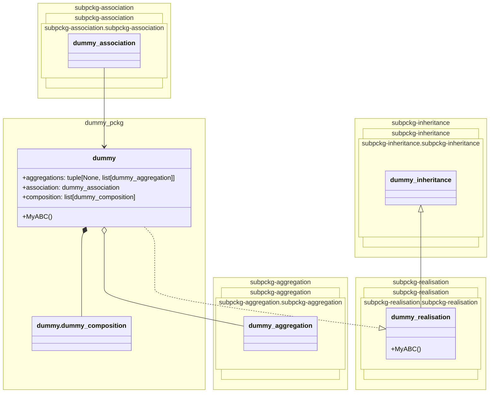

# Mardown UML Class Diagram

```mermaid
classDiagram
namespace `dummy_pckg`["dummy_pckg"]{
  class `dummy_pckg.dummy`["dummy"] {
    +aggregations: tuple[None, list[dummy_aggregation]]
    +association: dummy_association
    +composition: list[dummy_composition]
    +MyABC()
  }
  class `dummy_pckg.dummy.dummy_composition`["dummy.dummy_composition"] {
  }
}
namespace `subpckg-aggregation`["subpckg-aggregation"]{
  namespace `subpckg-aggregation.subpckg-aggregation`["subpckg-aggregation.subpckg-aggregation"]{
    class `subpckg-aggregation.subpckg-aggregation.dummy_aggregation`["dummy_aggregation"] {
    }
  }
}
namespace `subpckg-association`["subpckg-association"]{
  namespace `subpckg-association.subpckg-association`["subpckg-association.subpckg-association"]{
    class `subpckg-association.subpckg-association.dummy_association`["dummy_association"] {
    }
  }
}
namespace `subpckg-inheritance`["subpckg-inheritance"]{
  namespace `subpckg-inheritance.subpckg-inheritance`["subpckg-inheritance.subpckg-inheritance"]{
    class `subpckg-inheritance.subpckg-inheritance.dummy_inheritance`["dummy_inheritance"] {
    }
  }
}
namespace `subpckg-realisation`["subpckg-realisation"]{
  namespace `subpckg-realisation.subpckg-realisation`["subpckg-realisation.subpckg-realisation"]{
    class `subpckg-realisation.subpckg-realisation.dummy_realisation`["dummy_realisation"] {
      +MyABC()
    }
  }
}

`dummy_pckg.dummy` *-- `dummy_pckg.dummy.dummy_composition`
`dummy_pckg.dummy` o-- `subpckg-aggregation.subpckg-aggregation.dummy_aggregation`
`dummy_pckg.dummy` ..|> `subpckg-realisation.subpckg-realisation.dummy_realisation`
`subpckg-association.subpckg-association.dummy_association` --> `dummy_pckg.dummy`
`subpckg-inheritance.subpckg-inheritance.dummy_inheritance` <|-- `subpckg-realisation.subpckg-realisation.dummy_realisation`
```
