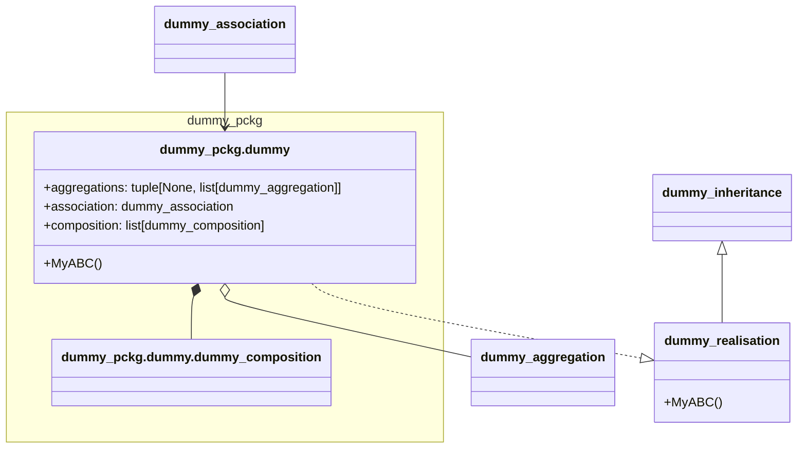

# Mardown UML Class Diagram

```mermaid
classDiagram
class `dummy_aggregation` {
}
class `dummy_association` {
}
class `dummy_inheritance` {
}
class `dummy_realisation` {
  +MyABC()
}
namespace `dummy_pckg`{
  class `dummy_pckg.dummy` {
    +aggregations: tuple[None, list[dummy_aggregation]]
    +association: dummy_association
    +composition: list[dummy_composition]
    +MyABC()
  }
  class `dummy_pckg.dummy.dummy_composition` {
  }
}

`dummy_association` --> `dummy_pckg.dummy`
`dummy_inheritance` <|-- `dummy_realisation`
`dummy_pckg.dummy` o-- `dummy_aggregation`
`dummy_pckg.dummy` *-- `dummy_pckg.dummy.dummy_composition`
`dummy_pckg.dummy` ..|> `dummy_realisation`
```
